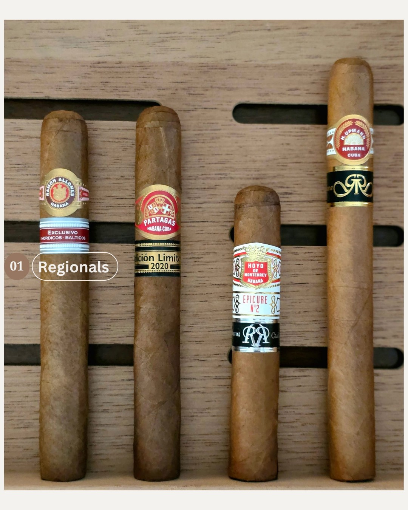
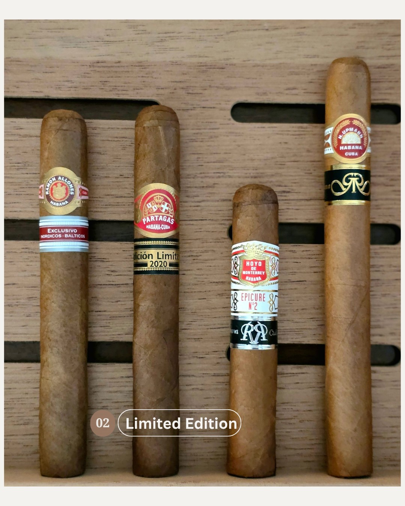
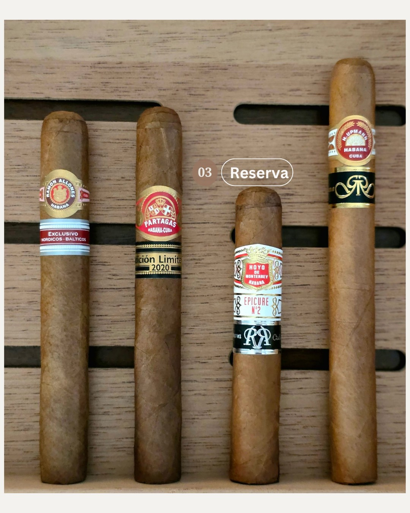
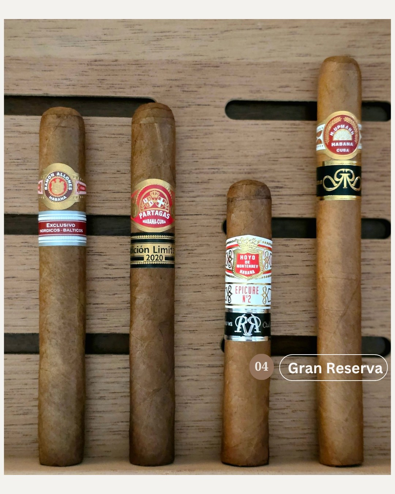

**Decoding Habanos: A Connoisseur's Guide to Reserva, Gran Reserva, and Special Edition Cigars**

For enthusiasts of Cuban cigars, the sight of a secondary band signals something special. Terms like "Reserva," "Gran Reserva," "Edición Regional," and "Edición Limitada" are not just marketing labels; they are designations of quality, rarity, and a specific aging philosophy dictated by Habanos S.A. Understanding what these categories represent is essential for any connoisseur looking to navigate the top tier of the cigar world.

While they all denote exclusivity, these classifications fall into two main groups: premium aged versions of existing cigars (Reserva/Gran Reserva) and distinct, unique releases (Regional/Limited). Let's break down what each one means.

#### The Niche Appeal: Edición Regional (Regional Edition)

In 2005, Habanos S.A. launched its Edición Regional program—a bold initiative that gave licensed distributors the opportunity to commission exclusive cigars tailored to their local markets. The very first release under this program was the Ramón Allones Belicosos Finos, crafted specifically for the UK, setting the tone for a series of coveted regional editions that followed.

Unlike Reservas, Regional Editions are not aged versions of existing cigars. Instead, they are **unique vitolas (sizes and shapes) produced for specific countries or regions** around the world. These cigars are typically made by smaller Habanos brands, giving them a chance to shine in a particular market. Production is extremely limited, often to just a few thousand boxes, making them instant collector's items in their designated region and rarities elsewhere. They are identified by a second, burgundy-and-silver band displaying the name of the region.

- **Production:** Unique sizes from smaller Habanos brands for a specific market.
- **Availability:** Exclusive to a single region (e.g., "Exclusivo Alemania" for Germany).
- **Presentation:** Unique branding and packaging specific to the release.

#### The Annual Treasure: Edición Limitada (Limited Edition)

Since the year 2000, Habanos has released a handful of "Edición Limitada" cigars annually. These are special, non-standard vitolas from some of the most famous brands. The defining characteristic of a Limited Edition is its wrapper. The wrapper leaves are typically darker and come from the upper primings of the tobacco plant. All the tobacco used is aged for a **minimum of two years**. These cigars are prized for their rich, often full-bodied flavor profiles. They are easily identifiable by their secondary black-and-gold band printed with "Edición Limitada" and the year of release.

- **Aging:** Minimum 2 years for all tobacco.
- **Production:** Released annually in limited quantities with a specific blend and size for that year only.
- **Presentation:** A distinctive secondary band indicating it is a "Limited Edition" and the year.

#### The Elegance of Reserva

Habanos S.A. introduced its Reserva Cosecha line in 2003 with the debut of the Cohiba Selección Reserva—a luxurious box of 30 cigars made exclusively from tobacco harvested in 1999. This milestone release set the stage for the even more prestigious Gran Reserva series, which followed in 2009.

The Reserva classification represents a significant step up from a brand's standard production. To earn the coveted silver-on-black "Reserva" band, every leaf of tobacco—filler, binder, and wrapper—must be aged for a **minimum of three years** before being rolled. This extended aging process mellows the tobacco, resulting in a smoother, more complex, and balanced flavor profile.

- **Aging:** Minimum 3 years for all tobacco.

- **Release Cycle:** Typically released in even-numbered years.
- **Presentation:** They are presented in stunning, individually numbered black lacquer boxes, often featuring elegant silver calligraphy.
- **Examples:** Iconic brands like Cohiba, Montecristo, Partagas, and Romeo y Julieta have all seen famous vitolas released in a Reserva version.

#### The Pinnacle: Gran Reserva

If Reserva represents elegance, Gran Reserva represents the absolute pinnacle of the Habanos portfolio. This classification takes the aging process a step further. For a cigar to be deemed a Gran Reserva, all of its tobacco must be aged for a **minimum of five years**. This extensive aging creates a smoke of unparalleled smoothness, depth, and sophistication. Gran Reservas are the rarest of the Habanos special productions and are highly sought after by collectors.

- **Aging:** Minimum 5 years for all tobacco.
- **Release Cycle:** Released in odd-numbered years, alternating with the Reserva program.
- **Presentation:** The packaging is even more luxurious, featuring black lacquered boxes with striking gold calligraphy and a black-and-gold Gran Reserva band.
- **Examples:** Only the most prestigious vitolas from top-tier brands like Cohiba and H. Upmann are selected for the Gran Reserva program.

**Release Rhythm of the Reserva Series**  Although Habanos S.A. selects a cigar annually for either Reserva or Gran Reserva distinction, the actual launch schedule follows a deliberate cadence. Reserva cigars typically debut in even-numbered years, while Gran Reserva releases are reserved for odd-numbered years—often timed to coincide with the prestigious Festival del Habano, adding an extra layer of anticipation to each unveiling.

### In Summary

In essence, the path to choosing your next special Cuban cigar becomes clearer with this knowledge. If you wish to experience a familiar, iconic blend in its most refined and aged form, seek out a **Reserva** or **Gran Reserva**. If you're a collector hunting for something unique and geographically exclusive, the **Regional Editions** are your prize. And for a taste of a specific year's best, showcasing a rich and powerful profile, the annual **Limited Editions** are a treasure waiting to be discovered.
