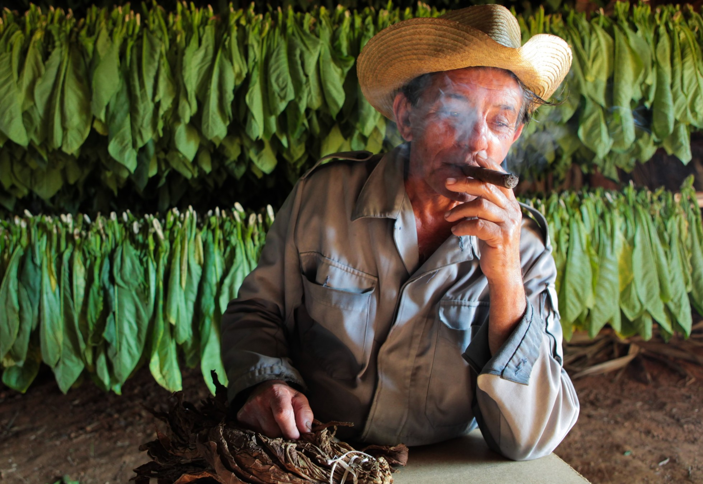

Most people botch their first cigar. They grab whatever's on the counter at a gas station, hack the cap off with a pocketknife, light it with a Bic, and inhale like it's a cigarette. Then they cough, get dizzy, and decide cigars aren't for them. That's not a cigar problem — that's a setup problem. Get the first hour right and the craft opens up.

This is the guide I wish someone had handed me before my first real smoke. It assumes nothing, skips the marketing, and tells you what actually matters.

## How to choose your first cigar

The most common rookie mistake is buying too much cigar. A Padron 1964 or a Cohiba Behike sounds impressive, but at full body and 90 minutes of nicotine, it's a fast track to nausea for an untrained palate. Start mild to medium and work up.

Three variables decide what you should grab:

**Body and strength.** Body is how heavy the smoke feels on the palate; strength is the nicotine load. Mild-to-medium is the right starting band — think a Macanudo Cafe, an Ashton Classic, or a Romeo y Julieta 1875. You'll taste cedar, cream, light pepper, and bread notes without getting knocked sideways.

**Size.** A Robusto (roughly 5 inches by 50 ring gauge) is the right first format. It gives you 45 to 60 minutes of smoking — long enough to see how the cigar develops, short enough that a beginner won't be exhausted by the end. Skip Churchills and Gordos until you've smoked twenty cigars.

**Wrapper.** This is the outer leaf, and it drives most of what you'll taste. Connecticut Shade is the gentlest entry — creamy, slightly sweet, almost coffee-with-cream on the palate. Habano Ecuador adds bright pepper. Maduro (the dark, oily wrappers fermented longer) brings chocolate, espresso, and dark fruit, but lands heavier on the palate than newcomers expect.

Origin matters less than the marketing suggests. Cuba's reputation is real, but Nicaragua and the Dominican Republic produce cigars that rival or beat Habanos in any blind tasting. A My Father Le Bijou (Nicaragua) or an Arturo Fuente Hemingway (Dominican Republic) will give you a better first experience than most entry-level Cubans.

## The tools that actually matter

You don't need a $400 humidor and a Dupont lighter to start. You need three things that work.

**A cutter.** A double-blade guillotine like the [Xikar Xi2](/blog/best-cigar-cutters-2026/) handles 95% of cigars and runs around $50. The dollar-store single-blade plastic cutters crush the cap and split wrappers — false economy.

**A flame.** A single-jet butane torch. Soft-flame Zippo or fluid lighters leave a kerosene aftertaste that lingers through the entire smoke. Long wooden matches work if you let the sulfur burn off for five seconds before bringing them near the cigar. Our [lighters roundup](/blog/best-cigar-lighters-2026/) covers what to buy by use case.

**Storage.** If you're buying more than two cigars a month, you need a humidor or at minimum a Tupperware-style airtight container with a [Boveda 69% RH pack](https://bovedainc.com/) tossed in. A small 25-count desktop humidor from Quality Importers or a similar maker runs about $70 and will keep your sticks alive for years.

## How to cut a cigar without ruining it

The head of the cigar (the rounded end you put in your mouth) is sealed with a thin layer called the cap. Your job is to remove just enough of the cap to open a draw, not so much that you cut past the "shoulder" — the curve where the cap ends and the wrapper begins. Cross that line and the wrapper unravels in your fingers.

Hold the cigar in one hand and the cutter in the other. Position the blades over the head, aim to take about 1/16th of an inch (roughly the thickness of a dime), and snap the cutter shut in one decisive motion. Hesitation produces jagged cuts. A clean V-cut or punch also works — full breakdown in our [guide to cutting a cigar properly](/blog/whats-the-best-way-to-cut-a-cigar-we-settle-the-debate/).

## Lighting and the first ten minutes

The light sets the tone for the whole smoke. Rush it and you've already lost.

Hold the cigar at a 45-degree angle, foot pointed down, and bring the flame about half an inch from the tobacco — close enough to warm it, not so close that it touches. Rotate the cigar slowly. You're toasting the foot, not igniting it yet. Watch for a uniform orange glow around the entire rim. That takes 15 to 30 seconds.

Then bring the cigar to your lips, hold the flame an inch from the foot, and draw gently while rotating. Two or three slow puffs should be enough. Pull the flame away and check the cherry — it should glow evenly across the whole foot. If one side is darker, touch it up for another couple of seconds. The full breakdown lives in our [guide on how to light a cigar](/blog/how-to-light-a-cigar/).

Now the rule that separates aficionados from coughing rookies: **don't inhale**. A cigar is tasted in the mouth and retrohaled (briefly pushed out through the nose), never pulled into the lungs. Inhaling cigar smoke is unpleasant and gives you nothing — the flavor lives on your palate and in your nasal passages, not your alveoli.

## Pacing the smoke

A cigar is a sipping ritual, not a chugging one. The single biggest rookie error is puffing too often. Hard, fast puffs heat the tobacco well past its design temperature, scorching the oils that carry flavor and producing a bitter, ammonia-edged smoke.

Target one puff every 45 to 60 seconds. Between puffs, the cherry should fade to a dull orange glow, not burn bright. If the foot or band gets hot to the touch, set the cigar down for a minute and let it cool.

A well-made cigar develops in thirds. The first third gives you cedar, light spice, and whatever the wrapper's signature is. The middle third is where the ligero (the strongest filler leaves) asserts itself — usually the most complex section. The final third intensifies, sometimes sweet and nutty, sometimes harsh if you've been smoking too hot.

### Ashing and relighting

Don't tap the ash like a cigarette. A well-rolled cigar will hold an ash an inch long or more before it falls. When it's ready, roll the foot gently against the side of an ashtray and the ash will drop cleanly.

If the cigar goes out — and it will, especially when you're learning the pace — that's not a failure. Knock off the dead ash, retoast the foot for a few seconds, and relight. The first puff after a relight tastes slightly burnt; smoke through it and the flavor recovers in 30 seconds.

## Before you light up

A few practical rules nobody publishes.

**Eat first.** Smoking a medium-bodied cigar on an empty stomach can drop your blood sugar and trigger the dreaded nicotine sickness — clammy hands, mild nausea, the room tilting. A meal beforehand fixes it.

**Keep a drink within reach.** Water works. A sugary backup (Coke, ginger ale, sweet iced tea) is genuinely useful if the nicotine starts to hit. Sugar shuts down most light-headedness in a few minutes.

**Remove the band carefully — and later, not now.** The paper ring near the head is glued with vegetable adhesive. After you've smoked about a third of the way down, the heat loosens the glue and the band slides off cleanly. Pull it cold and you'll tear the wrapper.

## Pairing without overthinking it

A good pairing amplifies what's already in the cigar. A bad one (overly hopped IPA, sugary cocktail, anything mentholated) overwhelms it.

Start simple. **Whiskey or bourbon** with a fuller cigar — the caramel and oak notes echo the wrapper's sweetness. **Espresso or black coffee** with a medium cigar — the bitterness sits nicely against the smoke. **Aged rum or cognac** with a Maduro — the dark fruit and molasses notes mirror each other. Skip wine with cigars; tannins and smoke fight each other.

## The etiquette nobody tells you

The unwritten rules separate aficionados from the loud guys at the hotel patio. Worth memorizing.

- **Never let someone light your cigar while it's in your mouth.** Hold the cigar in your hand so you can rotate it. Letting another person work the flame at your face is the universal sign of an amateur.
- **Don't stub a cigar out.** Premium cigars are designed to extinguish themselves within 90 seconds if you stop puffing. Stubbing creates a foul smell that lingers in the room.
- **Stop at the last third.** A cigar isn't meant to be smoked to the nub. Once you're down to about three finger-widths, the resin and tar concentrate, the smoke turns harsh, and you've moved from enjoying it to punishing yourself. Set it down with dignity.
- **Mind your smoke.** Even in a lounge, don't blow smoke directly at others, and don't light a strong cigar in a closed car with passengers. Cigar culture is built on shared time, not imposition.

For a deeper bench of skills once the basics feel natural, our [ten cigar essentials every aficionado should master](/blog/10-essentials-every-cigar-aficionado-should-master/) covers what comes next — fermentation, palate training, humidor science. For a canonical reference on the broader literature, [Cigar Aficionado's Cigar 101](https://www.cigaraficionado.com/article/cigar-101) is worth bookmarking.

---

Your first cigar shouldn't be a test you fail. Pick something mild, cut it cleanly, light it slowly, sip it for an hour, and pay attention to what you're tasting. Do that ten times and you'll have a palate. Do it a hundred times and you'll have a hobby that compounds for the rest of your life.
