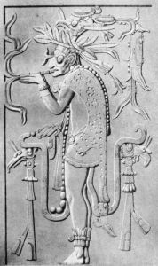
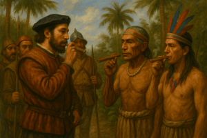
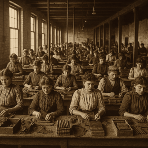
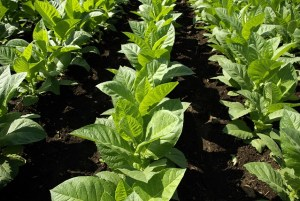
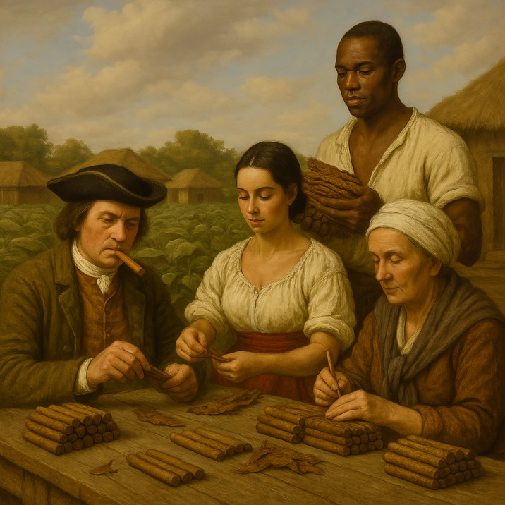

**Explore the captivating history of cigars, tracing their origins from ancient Mesoamerican civilizations to their status as a modern-day emblem of luxury and refined enjoyment. This journey will illuminate pivotal moments in cigar history, the evolution of tobacco cultivation, and the fascinating transformation of cigars into a global phenomenon.**

The story of the cigar begins not in the humidors of distinguished gentlemen, but in the ancient civilizations of Mesoamerica. Archaeological evidence suggests that the Mayans of Yucatán, Mexico, and the Taíno people of the Caribbean were among the first to cultivate and consume tobacco, as far back as the 10th century or even earlier. For these cultures, tobacco was far more than a simple pleasure; it was a sacred plant, integral to religious rituals, medicinal practices, and social ceremonies. They smoked tobacco leaves rolled into a primitive form of cigar, often referred to as “sik’ar” by the Mayans – a term believed to be the etymological root of the modern word “cigar.”

The arrival of Christopher Columbus in the Americas in 1492 marked a pivotal turning point. Columbus and his crew encountered the Taíno people smoking these rolled tobacco leaves and were intrigued by the practice. Rodrigo de Jerez, one of Columbus’s crewmen, is often credited as the first European to smoke tobacco, bringing the habit back to his native Spain. Initially met with suspicion – Jerez was reportedly imprisoned by the Spanish Inquisition for his “sinful and infernal” habit – the practice of smoking dried tobacco leaves gradually took root.

Spain, particularly Seville, became the epicenter of Europe’s nascent cigar industry. By the 17th century, [tobacco cultivation](https://en.wikipedia.org/wiki/Cultivation_of_tobacco)had spread to other parts of the Americas, including Cuba, whose climate and soil proved ideal for growing high-quality tobacco. Spanish colonists established plantations, and the production of cigars, initially a cottage industry, began to formalize. The Spanish held a tight grip on the tobacco trade for centuries.

The 18th and 19th centuries witnessed the popularization of cigars across Europe and beyond. Jean Nicot, the French ambassador to Portugal, is famously associated with introducing tobacco to the French court in the mid-16th century (his name giving rise to “nicotine”). However, it was later that cigar smoking truly flourished. Cigar factories emerged, and different types and sizes of cigars began to be developed. Great Britain and France, despite initial resistance, embraced cigar smoking, and it became a fashionable pastime among the aristocracy and affluent merchant class. The Peninsular War in the early 19th century is thought to have further popularized cigars as British and French soldiers brought the habit back from Spain.

Across the Atlantic, the United States also developed a taste for cigars. By the mid-19th century, cigar consumption was widespread, with numerous small factories established, particularly in states like Pennsylvania, New York, and Connecticut. Connecticut became known for its prized wrapper leaf. The preference for cigars grew steadily, and they became a ubiquitous symbol of American life, associated with figures ranging from presidents to pioneers.

The late 19th and early 20th centuries are often considered a golden age for cigars. The quality and variety of cigars expanded, and branding became increasingly important. [Cuban cigars](https://www.cubancigarwebsite.com/brands), in particular, gained an unparalleled reputation for excellence, becoming the benchmark against which all others were measured. Cigars became inextricably linked with success, power, and celebratory moments. Images of industrialists, financiers, politicians, and writers with a cigar in hand became commonplace, solidifying the cigar’s status as a symbol of luxury and sophistication.

The 20th century brought both challenges and changes to the cigar world. The rise of cigarettes, perceived as more convenient and modern, led to a decline in cigar consumption for a period. Political events also played a significant role. The Cuban Revolution in 1959 and the subsequent US embargo on Cuban goods, enacted in 1962, dramatically impacted the cigar industry. [Cuban cigar](https://www.cubancigarwebsite.com/brands)makers fled the island, taking their skills and seeds to other Caribbean and Central American nations like the Dominican Republic, Honduras, and Nicaragua, which began producing high-quality cigars that rivaled their Cuban counterparts.

A surprising resurgence in cigar popularity occurred in the 1990s, often dubbed the “cigar boom.” A renewed appreciation for craftsmanship, quality, and the leisurely enjoyment of a fine cigar fueled this revival. Cigar lounges and publications dedicated to cigars flourished, and a new generation discovered the pleasures of premium, hand-rolled cigars.

Today, the cigar remains a cherished indulgence for many around the globe. It continues to be associated with celebration, relaxation, and a discerning lifestyle. The cultivation of [tobacco](https://es.wikipedia.org/wiki/Tabaco) has evolved into a highly specialized agricultural science, with specific regions prized for their unique terroirs. The art of cigar making, from selecting and aging the leaves to expertly rolling the final product, is a testament to tradition and meticulous craftsmanship. While debates around[tobacco](https://es.wikipedia.org/wiki/Tabaco) use continue, the rich history and enduring allure of the cigar are undeniable, representing a fascinating journey from ancient ritual to a modern emblem of sophisticated pleasure.

