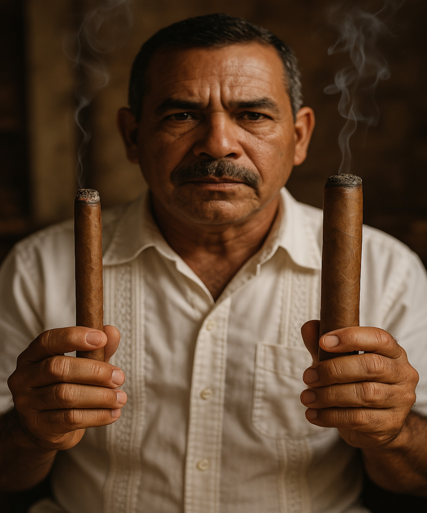

In the ever-evolving landscape of premium cigars, one trend has truly dominated in recent years: the undeniable shift towards larger ring gauge vitolas, particularly the **Toro (typically 6 x 50-54)** and, even more notably, the **Gordo (60+ ring gauge)**. This isn't just a fleeting fad; it's a deeply rooted preference that has reshaped cigar manufacturers' production strategies and consumers' humidors alike. The classic Corona (around 42-44 ring gauge) and even the once-ubiquitous Robusto (around 50 ring gauge) are finding themselves playing second fiddle as smokers gravitate towards more substantial smokes.

### Why the Surge in Size?

The reasons behind this robust revolution are multifaceted, touching upon sensory experience, perceived value, and the very artistry of cigar blending:

- **Extended Smoking Experience:** Perhaps the most frequently cited reason for the appeal of larger ring gauges is the desire for a longer, more contemplative smoking session. A Toro or Gordo can easily provide 60 to 90 minutes, or even more, of enjoyment, allowing the smoker to truly unwind and savor the moment. This extended duration provides ample time for the cigar's flavor profile to evolve and develop through its various acts, from the initial light to the final nuanced draws.
- **Enhanced Flavor and Complexity:** Counterintuitively to some traditionalists, many aficionados argue that larger ring gauges offer a richer, more complex flavor experience. With more filler tobacco in the blend, blenders have greater artistic freedom. They can incorporate a wider variety of tobacco leaves from different primings (positions on the plant), origins, and aging periods.This allows for a more intricate layering of flavors, creating a nuanced tapestry of notes that might not be possible in a thinner cigar where the wrapper's influence is more dominant. A 2022 survey by *Cigar Aficionado* even found that 71% of smokers who preferred larger ring gauges identified a richer smoking experience and more pronounced flavors.

- **Cooler and More Voluminous Smoke:** The increased diameter of a Toro or Gordo allows for a greater volume of smoke to pass through, which often translates to a cooler burning temperature. A cooler burn helps to prevent harshness and preserves the delicate flavor nuances of the tobacco. Furthermore, many smokers find the voluminous smoke produced by these cigars to be highly satisfying, contributing to the overall sensory pleasure.
- **Improved Draw and Consistency:** While it might seem counterintuitive, a larger ring gauge can sometimes provide a more consistent and easier draw. The greater amount of filler tobacco, when properly bunched, allows for better airflow. However, it's worth noting that rolling a well-constructed large ring gauge cigar is a testament to a *torcedor's* skill; achieving the right balance and even distribution is crucial to avoid issues like tunneling or canoeing.
- **Perceived Value and Presence:** In a market where premium cigars can be a significant investment, larger cigars often offer a perceived "more for your money" value due to the sheer volume of tobacco. Beyond that, there's an undeniable aesthetic appeal. Holding a substantial Toro or Gordo can feel more impactful and luxurious, a statement piece that enhances the overall experience. This perception of "bigger is better" plays a role in consumer choice.

### The Market's Response

Retailers consistently report that Toro and Gordo sizes are their top sellers, a clear indicator of widespread consumer preference. Cigar manufacturers have responded by expanding their portfolios to include a greater selection of these substantial vitolas. It's now rare for a new blend to be introduced without a Toro or Gordo option, and many existing lines have seen larger ring gauge additions. Even traditionally conservative Cuban cigar manufacturers, like Habanos S.A., have embraced the trend, with their premium cigar director noting that sales of 50+ ring gauge cigars account for over 50% of their total sales, a 50% increase over the past decade. Brands like E.P. Carrillo, with his popular "Inch" series (which goes up to 70 ring gauge), have been instrumental in pushing the boundaries and normalizing these larger sizes.

While personal preference always dictates the ultimate choice, the "Reign of Robust Ring Gauges" signifies a definitive shift in the cigar world, reflecting a collective desire for longer, more complex, and ultimately, more satisfying smoking experiences. It's a testament to the ongoing evolution of the cigar industry, constantly adapting to the sophisticated demands of its global community.

What is your favorite ring gauge?
